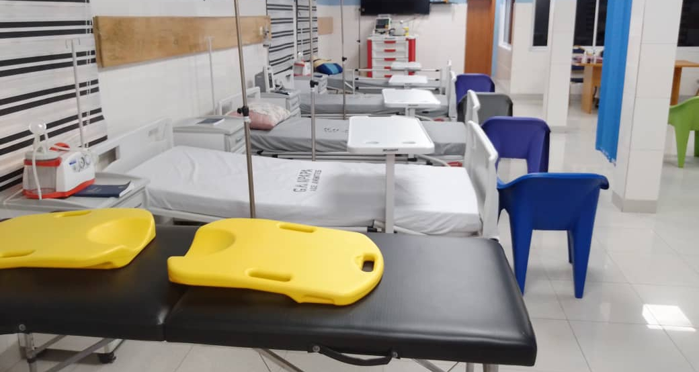
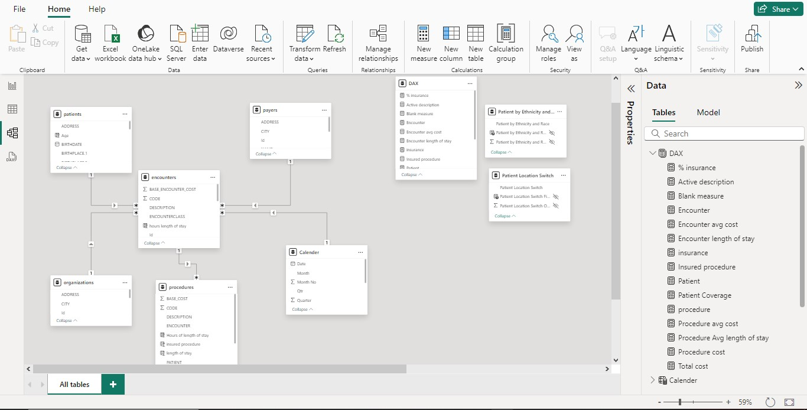
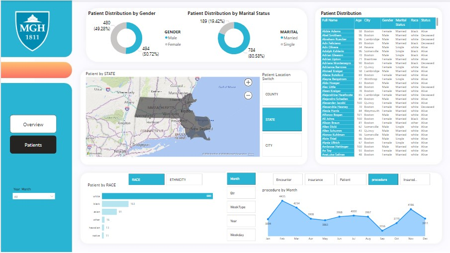
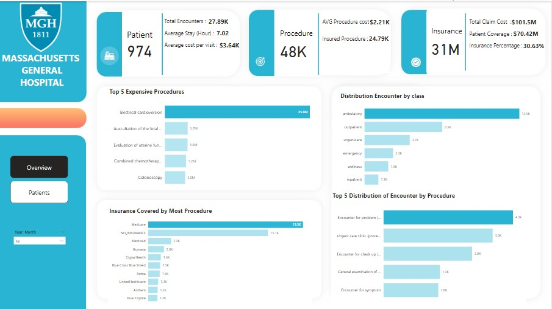

# Healthcare Data Analysis

- Table of Contents
- Introduction
- Data Sources
- Data Preparation
- Data Analysis
- Findings and Insights
- Power BI Report Structure
- Conclusion
## Introduction
This project aims to analyze healthcare data to provide insights into patient demographics, encounters, procedures, and financial aspects of the healthcare services provided. The analysis is structured into three main parts: Patient Demographics, Encounters Analysis, and Financial Analysis.

## Data Source

The data used in this project was gotten from Maven Analytics and it has the following CSV files:
- patients.csv: Contains demographic information about patients, including age, gender, race, and location.
- encounters.csv: Details patient encounters with healthcare services, including encounter type, start and stop times, and associated diagnoses.
- procedures.csv: Lists the procedures performed during patient encounters.
- payers.csv: Information on the payers involved in patient encounters, including insurance companies and other payers.
- data_dictionary.csv: Provides a detailed description of each field present in the datasets.

## Data Preparation
The data preparation phase involved several steps to ensure the datasets were ready for analysis:

3.1 Loading Data
All CSV files were loaded into Power BI for analysis.

3.2 Data Cleaning
Missing Values: Checked for missing values and handled them appropriately (e.g., removing rows with critical missing information, imputing missing data where applicable).
Data Types: Ensured correct data types for all columns, especially date and numeric fields.

3.3 Data Transformation
Age Calculation: Age was calculated based on the patient's birthdate and the current date.

## Data Modelling 
The data was model which was star schema 

## Skill Demonstrated :

The following Power BI Feature were incoporated :
- DAX
- Page Navigation
- Filters, Button, Tooltips
- Modelling
## Visulaization 
The report conatin 2 pages :
1. Overview
2. Patients

You can interact with the report here [here](https://app.powerbi.com/view?r=eyJrIjoiNTYzNzVmZTEtYjIyMC00ZDlkLWI4NzMtYTcyMTdmZDExYTA4IiwidCI6ImRmODY3OWNkLWE4MGUtNDVkOC05OWFjLWM4M2VkN2ZmOTVhMCJ9)

### **Insights and Recommendations**

#### **1. Patient Demographics**
- **Insight:** The patient population is fairly balanced in terms of gender, with a slight majority of female patients (494) over male patients (480). The majority of patients are married (784) compared to single (189). The White race is the most represented among patients, while the Native race is the least.
- **Recommendation:** Consider targeted outreach programs or campaigns focusing on single and minority populations to improve healthcare access and engagement.

#### **2. Procedure Analysis**
- **Insight:** Electrical cardioversion is the most expensive procedure, and February records the highest number of procedures (4,435), with September being the lowest (3,556). Monday has the highest number of procedures, while Tuesday has the lowest.
- **Recommendation:** Investigate the reasons behind the high volume of procedures in February and on Mondays to ensure resource allocation is optimized during peak periods. Consider strategies to distribute the procedure load more evenly across the week.

#### **3. Encounter Analysis**
- **Insight:** Ambulatory encounters are the most frequent (12,500), while inpatient encounters are the least (1,100). February has the highest number of encounters (3,023), with September having the lowest. Wednesday sees the highest encounters, while Thursday is the lowest.
- **Recommendation:** Given the lower volume of inpatient encounters, it may be worth reviewing the efficiency of inpatient services. Additionally, explore why Wednesdays and February have higher encounter rates to potentially replicate successful practices during lower-demand periods.

#### **4. Insurance and Financial Analysis**
- **Insight:** Medicare covers the most procedures, while Dual Eligible covers the least (1,200). The insurance coverage is highest on Mondays and in 2014, with a decline noted by 2018.
- **Recommendation:** Explore the factors leading to the peak in insurance coverage in 2014 and the decline by 2018. Strengthening relationships with insurers and understanding patient insurance trends could help reverse the downward trend.

#### **5. Temporal Trends**
- **Insight:** The first quarter of the year has the highest turnout in terms of procedures and encounters, with February being a peak month. The activity drops significantly in September. Monday is the busiest day for procedures, while Thursday sees the lowest.
- **Recommendation:** Align staffing, equipment, and other resources to match the higher demand during the first quarter and on Mondays. Consider promotional or engagement strategies to boost patient activity during typically low periods like September and on Thursdays.

By leveraging these insights, your healthcare facility can better align resources, improve patient engagement, and optimize financial performance.

